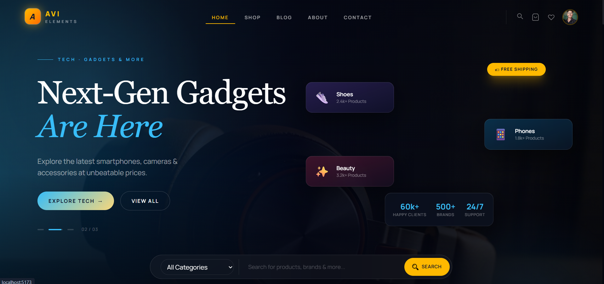

# AVI ShopCart



A modern and responsive e-commerce shopping cart application built with React and Vite.

## Overview

This project is a polished shopping experience that includes product browsing, cart management, authentication, and responsive UI components. It uses Firebase Authentication for secure login and Redux Toolkit for state management.

## Features

- **Authentication**
  - Email and password signup/login
  - Google sign-in
  - Persistent login state
  - Logout support
  - Protected routes for secure pages
- **Shopping Cart**
  - Add, remove, and update cart items
  - Dynamic cart badge count
  - Realtime totals and quantity updates
- **UI / UX**
  - Responsive design for mobile and desktop
  - Tailwind CSS styling
  - Animated interactions and dropdowns
  - Product search with autocomplete results
- **Additional Pages**
  - Blog
  - Contact
  - About
  - Orders and profile pages
  - Wishlist

## Tech Stack

- React
- Vite
- Tailwind CSS
- React Router DOM
- Firebase Authentication
- Redux Toolkit
- ESLint

## Project Structure

- `src/` – main React source files
- `src/components/` – reusable UI components
- `src/Home/` – home page sections and layouts
- `src/Shop/` – shop, product, cart, and checkout pages
- `src/context/` – authentication provider
- `src/firebase/` – Firebase configuration
- `src/utilis/` – Redux slices and utilities

## Setup

1. Install dependencies:
   ```bash
   npm install
   ```
2. Create a `.env` file with Firebase config values.
3. Start the development server:
   ```bash
   npm run dev
   ```

## Deployment

- The app is configured for deployment with Vercel using `vercel.json`.
- Firebase hosting is also configured via `firebase.json`.

## Notes

- Make sure Firebase Authentication is set up correctly for your project.
- Update the product data in `src/products.json` as needed.
- Customize the app branding and image assets in `src/assets/images/`.
