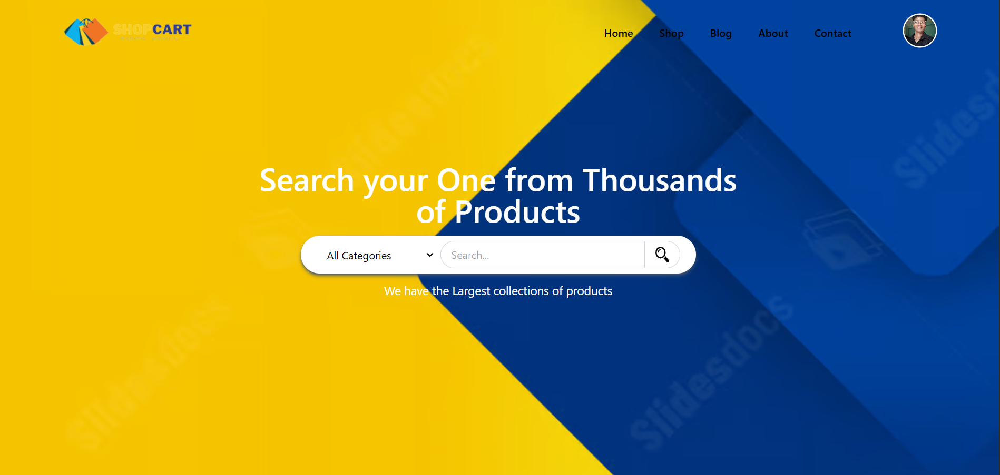

# React + Vite

🛒 Shopping Cart Website

## Description

A modern and responsive shopping cart web application built using Vite, React, Tailwind CSS, React Router DOM, and Firebase Authentication. This e-commerce platform allows users to browse products, add them to a cart, manage their shopping experience, and securely authenticate using email/password or Google sign-in. The app features real-time cart updates, protected routes, and a clean, intuitive user interface designed for seamless online shopping.

## Key Features

- **🔐 Authentication**
  - Email & Password signup/login
  - Google Authentication
  - Firebase Authentication
  - Persistent login state
  - Logout functionality
  - Route protection using PrivateRoute
  - Redirect user back to requested page after login

- **🛒 Shopping Cart**
  - Add, remove, and update cart items
  - Dynamic cart badge
  - Real-time item calculation
  - Cart page protection (only logged-in users can access)

- **🎨 UI/UX**
  - Built with Tailwind CSS
  - Fully responsive design
  - Clean and modern UI
  - Image-based product cards
  - Animated dropdown profile menu
  - Shimmer loading effects
  - Category showcases and brand displays

- **📄 Additional Features**
  - Blog section for articles
  - Contact form
  - About us page
  - Client testimonials
  - Product reviews and ratings
  - Search functionality
  - Pagination for product listings

## Libraries and Technologies

- **Frontend Framework:** React
- **Build Tool:** Vite
- **Styling:** Tailwind CSS
- **Routing:** React Router DOM
- **Authentication:** Firebase Auth
- **State Management:** Redux Toolkit (CartSlice)
- **Icons and Assets:** Custom icons and images
- **Deployment:** Vercel (configured in vercel.json)
- **Linting:** ESLint (eslint.config.js)
- **Firebase Hosting:** Configured in firebase.json

## Points with Image

- **Responsive Design:** The app is fully responsive, ensuring a great experience on all devices.
- **Secure Authentication:** Integrated Firebase for secure user authentication and data protection.
- **Real-time Updates:** Cart updates in real-time for immediate feedback.
- **Modern UI:** Clean, modern interface with Tailwind CSS for fast styling.
- **Product Management:** Easy browsing, searching, and managing products with categories and tags.

React + Vite (Fast frontend bundler)

Tailwind CSS

React Router DOM

Firebase Auth

Environment Variables (.env)
